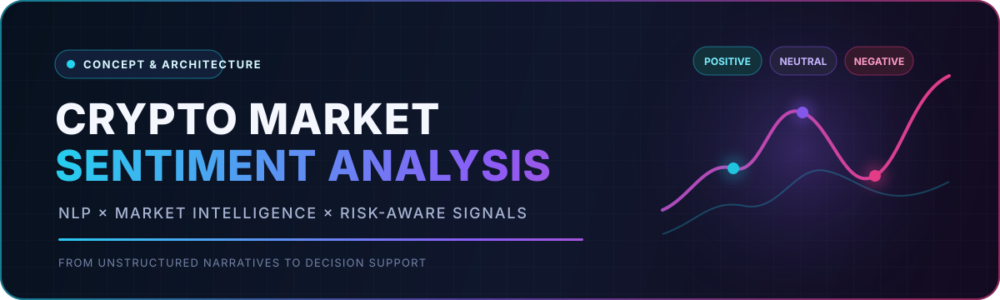
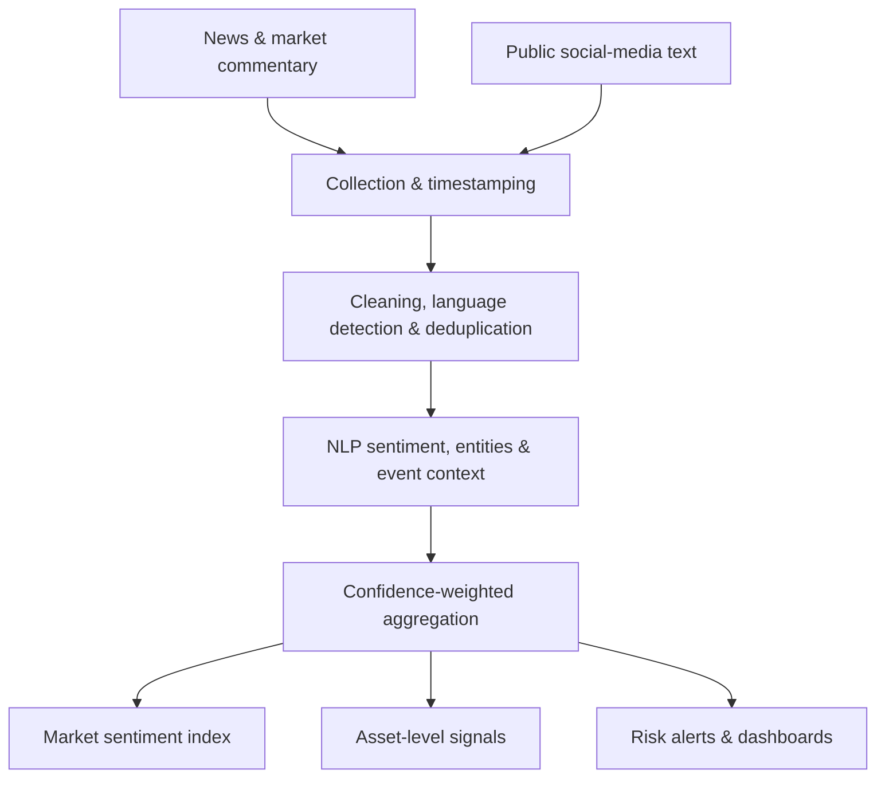

<div align="center">
  
</div>

<div align="center">


</div>

# Crypto Market Sentiment Analysis

This repository documents a product and research concept for transforming **cryptocurrency news, social-media narratives, and public market commentary** into structured sentiment intelligence.

The idea was originally explored as a potential sentiment-analysis component for the **Bitpy cryptocurrency trading roadmap**. Its purpose is to complement quantitative market data with information about market mood, investor behaviour, and the perceived impact of news or events.

> **Repository status:** Concept and architecture documentation. The original repository did not contain a dataset, trained model, implementation files, backtest, or reported performance metrics. The sections below define the intended scope without presenting unverified results.

---

## 🎯 Product Objective

Crypto markets react not only to prices and volumes but also to narratives. A structured sentiment layer could help a research or trading system:

- monitor changes in overall **market sentiment**;
- estimate the perceived impact of **news and market events**;
- compare sentiment across assets, topics, and information sources;
- generate an interpretable **sentiment index** over time;
- provide sentiment features for downstream **trading-signal research**;
- support risk monitoring when sentiment shifts suddenly or becomes unusually polarised.

Sentiment should be treated as a supporting signal rather than a standalone trading decision.

---

## 🧭 Conceptual Architecture



The architecture separates **data collection**, **text understanding**, and **decision support** so that each layer can be independently evaluated and improved.

---

## 🔍 Intended Analysis Pipeline

| Stage | Purpose | Important considerations |
|---|---|---|
| **Source collection** | Gather public news, commentary, and social text | provenance, licensing, rate limits, and timestamp consistency |
| **Preprocessing** | Clean text and remove noise or duplicates | URLs, hashtags, spam, bots, language, and repeated stories |
| **Entity resolution** | Link text to assets, protocols, or events | ticker ambiguity, aliases, and multi-asset articles |
| **Sentiment inference** | Estimate polarity, intensity, and confidence | domain-specific language, sarcasm, negation, and uncertainty |
| **Aggregation** | Build time-series sentiment measures | source quality, confidence, recency, and sample imbalance |
| **Evaluation** | Test usefulness and robustness | labelled accuracy, drift, leakage, and out-of-sample backtesting |
| **Decision support** | Expose indexes, alerts, or model features | explainability, latency, risk limits, and human oversight |

---

## 📐 Example Signal Design

A transparent aggregate score can begin with a confidence- and source-weighted measure:

```text
sentiment_score(t) = Σ [source_weight × model_confidence × polarity] / Σ weights
```

Where:

- `polarity` is a signed sentiment value, such as `-1` to `+1`;
- `model_confidence` reduces the effect of uncertain classifications;
- `source_weight` can reflect reliability, duplication risk, or historical relevance;
- the score is calculated within a defined time window and can be produced per asset or for the market overall.

A production study would compare this interpretable baseline with more sophisticated aggregation and time-decay methods.

---

## 🧪 Evaluation Framework

Any implementation should be evaluated at three separate levels:

1. **NLP quality** — classification performance on labelled, domain-relevant text.
2. **Signal quality** — stability, timeliness, calibration, and resistance to noisy or manipulated sources.
3. **Decision value** — incremental information beyond price/volume baselines in strictly out-of-sample tests.

Useful measurements may include macro/micro F1, calibration error, class balance, coverage, signal turnover, lead-lag analysis, drawdown, and robustness across market regimes. These are proposed evaluation criteria, not results reported by this repository.

---

## 🛠️ Candidate Implementation Stack

The following stack is suitable for a future implementation; it is not presented as code currently contained in this repository.


Potential baselines include lexicon methods and TF–IDF classifiers, followed by domain-adapted transformer models if justified by labelled data and evaluation results.

---

## 🗺️ Development Roadmap

- [x] Define the product motivation and primary use cases
- [x] Document a modular architecture and evaluation approach
- [ ] Select legally usable, timestamped data sources
- [ ] Define a labelled evaluation dataset and annotation policy
- [ ] Implement preprocessing and entity resolution
- [ ] Build interpretable sentiment baselines
- [ ] Compare domain-adapted NLP models
- [ ] Construct confidence-weighted sentiment indexes
- [ ] Run leakage-aware, out-of-sample signal evaluation
- [ ] Add monitoring for model drift and source manipulation
- [ ] Build a research dashboard and documented API

---

## ⚠️ Limitations & Responsible Use

Crypto sentiment data can be heavily affected by bots, coordinated campaigns, selective reporting, language bias, and rapid concept drift. A high-confidence text classification is not the same as a reliable forecast.

Any future implementation should therefore include:

- source provenance and duplicate detection;
- uncertainty and confidence reporting;
- manipulation and bot-resistance checks;
- explicit transaction-cost and latency assumptions;
- strict separation between research outputs and financial advice;
- human review for material risk or trading decisions.

---

## 👩‍💻 Author

**Niko Rokni Lamouki** — Product Manager, Lecturer & DeFi Researcher

[](https://github.com/nikorokni)
[](https://uk.linkedin.com/in/niko-rokni-lamouki)
[](https://scholar.google.com/citations?user=TMDumBYAAAAJ&hl=en)

---

<div align="center">
  <sub>From unstructured narratives to transparent, risk-aware decision support.</sub>
</div>
